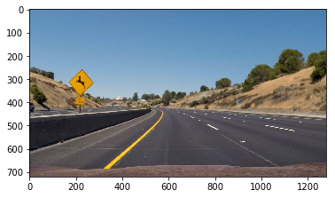

# Advanced Lane Finding

## Udacity Self Driving Car Engineer Nanodegree - Project 4

The goal of this project is to develop a pipeline to process a video stream from a forward-facing camera mounted on the front of a car, and output an annotated video which identifies:
- The positions of the lane lines 
- The location of the vehicle relative to the center of the lane
- The radius of curvature of the road

The pipeline created for this project processes images in the following steps:

1. Apply distortion correction using a calculated camera calibration matrix and distortion coefficients.

1. Apply a perspective transformation to warp the image to a birds eye view perspective of the lane lines.

1. Apply color thresholds to create a binary image which isolates the pixels representing lane lines.

1. Identify the lane line pixels and fit polynomials to the lane boundaries.

1. Determine curvature of the lane and vehicle position with respect to center.

1. Warp the detected lane boundaries back onto the original image.

1. Output visual display of the lane boundaries and numerical estimation of lane curvature and vehicle position.

### Code:

This project requires python 3.5 and the following dependencies:

- [NumPy](http://www.numpy.org/)
- [matplotlib](http://matplotlib.org/)
- [OpenCV](http://opencv.org/)
- [MoviePy](http://zulko.github.io/moviepy/)

### Step 1: Distortion Correction
The OpenCV functions `findChessboardCorners` and `drawChessboardCorners` are used to identify the locations of corners on a series of pictures of a chessboard taken from different angles.

The chessboard corners are then used to compute the calibration matrix and distortion coefficients using the OpenCV function `calibrateCamera`. 

The camera calibration matrix and distortion coefficients are then used to rectify images using the OpenCV function `undistort`
sample on a chess board:

sample on a road image:

Note: The distortion is mainly detectable close to the images edges

### Step 2: Image treatment

To extract the lines from the images, a HSV filter is used.
Then the image is tested with some sobel transformation.

To select the filter values, a small application has been written taking advantage of OpenCV `Trackerbar` functions (create,set,get).

A first filter is used to extract the yellow lines
A second filter is used to isolate the wite lines
they are then combined with a max function.

 

image of the testing application:

Note this small program allow the test of HSV filters (Hue, Saturation, value) and sobel filters (sobel alongx, sobel along y, sobel direction, sobel magnitude) for kernel of size 3,5 or 7.
the code is attached:(image_test.py)

The use of Sobel transform after the HSV filtering do not seem to improve the line detection any further, and therefore have not been used in this case.

### Step 3: Perspective Transform
The undistorted image is transformed into a "birds eye view" restricted to the area close to the lanes.
This transformation removes the vanishing point.
The OpenCV functions `getPerspectiveTransform` and `warpPerspective` are used to compute the transformation matrix and to apply it to an image.
To calibrate the transformation matrix, on a straight line picture 4 points are selected along the right and left lanes and the image is given as the corner of a rectangle in the 'top' view.
points selected on the straight line image:

the bird eye view of the same image and another one:

  

corresponding top view post image treatment:

  

### Steps 4,  Fitting a polynomial to the lane lines, 
A second order polynomial is computed for both lanes, for this

- the peak intensity is computed in an horizontal middle image section to locate the right and left lines.

- The image is split in detection boxes creeping up and down from the found lane locations

- A polynomial is fitted through the center of gravity of all the boxes.

line detection picture:

 

### Step 5 calculating vehicle position and radius of curvature:

The vehicle position with respect to the lanes is obtained by computing the average of the x intercepts from each of the two polynomials minus the halfway point along the horizontal axis.
The distance is then converted in cm assuming a distance between lanes of 3.7m.

### Step 6 Calculating the Radius of curvature

- The radius of curvature is obtained from the line equations, using the formula presented in the course.
- It then multiplied by the y compression coefficient used
- In this case it is assumes that the distance between 3 dotted lines correspond to 13m.
- The final radius of curvature is the average of the left and right radius.
- If a radius is greater than 3km, it is assumed that the vehicle is driving straight.

### Step 7: Output visual display.

- The polynomials are drawn on a black image.
- this image is unwrapped using the inverse of the perspective transform previously used.
- the result is merged with the original images
- the radius of curvature and vehicle position is then added as text to the image.

## Video Processing Pipeline:

All the previous steps are aggregated to process the video

To achieve a smooth output, the video pipeline first checks whether or not the lane was detected in the previous frame. 
If it was, then it only checks for lane pixels in close proximity to the polynomial calculated in the previous frame.
If not,it will scan the entire binary image for nonzero pixels to represent the lanes.

In order to make the output smooth I chose to limit the polynomial coefficient variation to 20% of their previous value. 
the .mp4 video is provided as an separate file.

### Discussion:

The video pipeline developed in this project detects the lane lines in the test video provided for the project, this is the case of a road in good conditions, with distinct lane lines, and on a clear day. 
nevertheless, the program robustness can be improved since it will react badly if:

- it cannot detect the lines at the start, or it is detecting something else than a line
- there are other marking on the road
- the visibility or luminosity conditions are bad 
- small radius of curvature are getting the lines our of the image
- loss of a lane

It look to me like the hsv image filtering used is too dependent to this video and may not generalise easily
